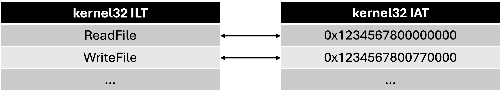

## Module 0x01: PE File 2
このモジュールでは、PE ファイルが実行される際の挙動について学習する。

### ロード・リロケーション
実行形式ファイルは、実行時にそのままメモリ上に乗っかるわけではなく、リロケーション (再配置) という処理が入る。

例えば、セクションのロードは代表的なリロケーションと言える。ベースアドレスにセクションヘッダが指定する `VirtualAddress` (RVA) を加えた箇所 VMA に、セクションが配置される:

その他にも、ASLR (Address Space Layout Randomization) が有効になっている場合は、実行毎にベースアドレスが変化する。この場合も、PE ファイル内のアドレスを正しく計算し直して、適切な値に書き換えてやる必要がある。

この挙動は、特に疑似マルウェアを作成する際や、バイナリエクスプロイトにおいて必要な知識となる。

| Name | Stands for |
| ---  | --- |
| RVA  | Relative Virtual Address |
| VMA  | Virtual Memory Address |
| RA   | Raw Address |

### Exercise 1.1
[HelloWorld.exe](./HelloWorld.exe) を PE-bear で開き、.data セクションの RVA を確認してみよう。HelloWorld.exe が 0x1234567800000000 に展開される際、.data セクションはどのアドレスに配置されるだろうか?

## Import Lookup Table (ILT)・Import Address Table (IAT)
PE ファイルをロードする際、動的リンクされた DLL もロードされる。プログラムがライブラリの関数を使用している場合、この中の関数のアドレスも解決する必要がある。このとき、解決するために ILT に関数名などが保存され、IAT に解決後のアドレスが保存される。後者は ELF の GOT section に対応する。

ILT と IAT は以下のような構造になっている。PE ローダは ILT の関数名からアドレスを解決し (例外もある)、ILT 内のインデックスと同じ位置にある IAT 内のエントリにアドレスを保存する。

> [!CAUTION]
> 上記の図は説明のために簡単にしているが、[モジュール 0x02](./module_0x02.md) で詳しく解説する
