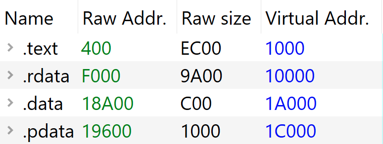

## Module 0x02: ILT パーサ
このモジュールでは、モジュール 0x01 で学習した ILT について更に掘り下げる。

リバースエンジニアリングにおいて、プログラムが使用している API の情報は大きなヒントになる。

例えば、脆弱性を探す文脈だと、source と sink という概念があり、source はユーザの入力など、脆弱性を引き起こす起点となるコードの箇所を、sink は脆弱性が実際に発生する箇所を意味する。このとき、一番最初に確認するべきなのは API の情報で、ファイル系の API があれば、source として使えるんじゃないか、`memcpy`、`strcpy` などのメモリ操作系の API は sink になるんじゃないかといった具合に、推測の起点として使うことができる。

また、スレットハンティングの文脈では、マルウェアが使いがちな API の組み合わせで探索すれば、隠れているマルウェアをあぶり出すことができるかもしれない。

もちろん、ファイルが1つ、2つであれば手作業で解析ツールに投げて確認すればいいが、解析を自動化できれば、大規模で柔軟、かつ迅速な API の探索が可能になる。API といえば[モジュール 0x01](./module_0x01.md) の ILT で、ここで ILT をパースしようという話が出てくる。

### Import Directory Table (IDT) の取得
ILT は、Import Directory Table (IDT) 内のポインタ `OriginalFirstThunk` から辿ることができ、IDT のアドレスは Import Directory の `VirtualAddress` に保存されている:

```c
typedef struct _IMAGE_IMPORT_DESCRIPTOR {
    union {
        DWORD   Characteristics;            // 0 for terminating null import descriptor
        DWORD   OriginalFirstThunk;         // RVA to original unbound IAT (PIMAGE_THUNK_DATA)
    } DUMMYUNIONNAME;
    DWORD   TimeDateStamp;                  // 0 if not bound,
                                            // -1 if bound, and real date\time stamp
                                            //     in IMAGE_DIRECTORY_ENTRY_BOUND_IMPORT (new BIND)
                                            // O.W. date/time stamp of DLL bound to (Old BIND)

    DWORD   ForwarderChain;                 // -1 if no forwarders
    DWORD   Name;
    DWORD   FirstThunk;                     // RVA to IAT (if bound this IAT has actual addresses)
} IMAGE_IMPORT_DESCRIPTOR;
```

```c
typedef struct _IMAGE_DATA_DIRECTORY {
    DWORD   VirtualAddress;
    DWORD   Size;
} IMAGE_DATA_DIRECTORY, *PIMAGE_DATA_DIRECTORY;
```

> [!NOTE]
> 詳細は省いたが、Import Directory の RVA は Optional Header に保存されている。気になる人は PE-bear で確認してみてほしい。

が、困ったことに Import Directory の `VirtualAddress` はリロケーション後のメモリ上のベースアドレスからの RVA で表現されており、リロケーション前の生の PE ファイルの先頭からのオフセットである RA ではない。本モジュールでは実行前の生の PE ファイルを静的に解析することを目的としており、このように、RA を計算したい場面がある。どうすればよいだろうか? 1つのやり方として、セクションヘッダには ロード後に展開されるアドレスの `VirtualAddress` (RVA) と、ファイル先頭からのオフセットである `PointerToRawData` (RA) というメンバーが含まれており、この対応を用いれば RVA を RA に変換することができる。

```c
typedef struct _IMAGE_SECTION_HEADER {
    BYTE    Name[IMAGE_SIZEOF_SHORT_NAME];
    union {
            DWORD   PhysicalAddress;
            DWORD   VirtualSize;
    } Misc;
    DWORD   VirtualAddress;
    DWORD   SizeOfRawData;
    DWORD   PointerToRawData;
    DWORD   PointerToRelocations;
    DWORD   PointerToLinenumbers;
    WORD    NumberOfRelocations;
    WORD    NumberOfLinenumbers;
    DWORD   Characteristics;
} IMAGE_SECTION_HEADER, *PIMAGE_SECTION_HEADER;
```

この対応を使って、右の RVA から差分を引けば、左の RA を計算できる:


```
base + idt_ra
= base + idt_rva - (sec_rva - sec_ra)
= base + idt_rva -  idiff
```

よって、差分である idiff を計算しておくと、RA を意識せずに楽に参照できるようになる。この処理に対応するコードは以下の通り:

```c
// PE ファイルがメモリに展開されたときの、IDT のベースアドレスからのオフセット RVA
DWORD dwDirVA = pOptHeader->DataDirectory[IMAGE_DIRECTORY_ENTRY_IMPORT].VirtualAddress;

// IDT が存在するセクションを、RVA がセクションの範囲に含まれるかで探す
PIMAGE_SECTION_HEADER pHeader = FindSectionHeaderFromVA(lpPe, aSecHeaders, dwDirVA);
if (not pHeader) {
    return std::map<std::string, std::map<std::string, ULONGLONG>>();
}

// RVA とファイル先頭からのオフセットの差分
LONG idiff = pHeader->VirtualAddress - pHeader->PointerToRawData;
```

最後に、差分を使って IDT のポインタを取得する:

```c
PIMAGE_IMPORT_DESCRIPTOR GetImportDirectoryTable(LPBYTE lpPe, PIMAGE_OPTIONAL_HEADER64 pOptHeader, LONG idiff = 0) {
    PIMAGE_IMPORT_DESCRIPTOR pIDT = (PIMAGE_IMPORT_DESCRIPTOR)(lpPe + pOptHeader->DataDirectory[IMAGE_DIRECTORY_ENTRY_IMPORT].VirtualAddress - idiff);
    return pIDT;
}
```

例えば、[HelloWorld.exe](./HelloWorld.exe) の .data セクションを確認してみると、ファイルの先頭からの RA 0x18A00 の位置にある内容が、メモリ上で 0x1A000 の RVA に展開されることが分かる。このときの差分 (idiff) は 0x1A000-0x18A00 = 0x1600 となる。



### ILT のパース
IDT は IMAGE_IMPORT_DESCRIPTOR の配列になっており、この構造体は DLL の情報を含む。`OriginalFirstThunk` は ILT への RVA を示しており、差分を考慮しながら各メンバーの値を読み取っていけばいい。

```c
// Iterate through DLLs
PIMAGE_IMPORT_DESCRIPTOR pd = pIdt;
while (pd->OriginalFirstThunk) {
    LPSTR szDllName = (LPSTR)(lpPe + pd->Name - idiff);

    table[szDllName] = std::map<std::string, ULONGLONG>();

    PIMAGE_THUNK_DATA64 pIlt = (PIMAGE_THUNK_DATA64)(lpPe + pd->OriginalFirstThunk - idiff);
    PIMAGE_THUNK_DATA64 pIat = (PIMAGE_THUNK_DATA64)(lpPe + pd->FirstThunk - idiff);

    // Iterate through functions
    while (pIlt->u1.AddressOfData and pIat->u1.AddressOfData) {
        // NOTICE: The contents of IAT are just same as ILT in a raw data
        ULONGLONG lpFunctionAddr = pIat->u1.AddressOfData;

        // <snip>

        LPCSTR szFunctionName = ((PIMAGE_IMPORT_BY_NAME)(lpPe + pIlt->u1.AddressOfData - idiff))->Name;

        table[szDllName][szFunctionName] = lpFunctionAddr;

        pIlt++;
        pIat++;
    }

    pd++;
}
```

### Exercise 2.1
[HelloWorld.exe](./HelloWorld.exe) 内の User32.dll の ILT は、どこに保存されているだろうか? PE ファイルの先頭からのオフセットである RA で答えよ。10進数、16進数のどちらでも構わない。

### Exercise 2.2
[ReadILT](./ReadILT/) を開いてビルドし、`File > Open a PE file` から [HelloWorld.exe](./HelloWorld.exe) を開いてみよう。一番最後にはどの API 名が表示されているだろうか?

### Exercise 2.3
C:\Windows\System32 直下に存在する .exe ファイルで、`ReplaceFileW` を使用しているアプリケーションを探してみよう。.exe ファイルの名前がフラグ。

テンプレートとして [ex_0x23](./ex_0x23) を用意してある。
