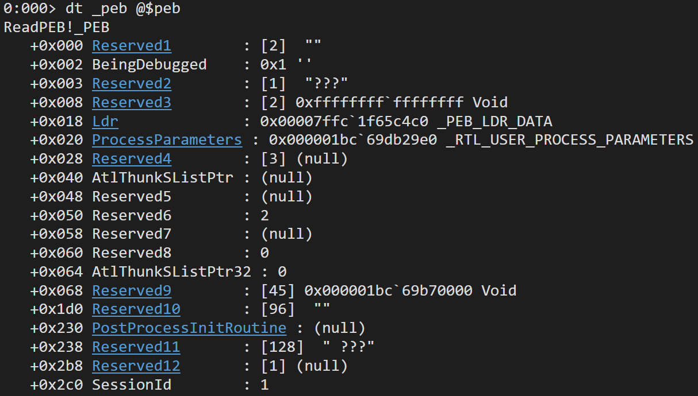

## Module 0x03: プロセス
このモジュールでは、Windows 環境のプロセスについて学習する。

プロセスとは実行される処理の単位のことで、OS の基本的な概念の1つである。これまでのモジュールで見てきたように、PE ファイルは実行時にメモリに展開され、プロセスとして OS によって管理される。

### [PEB](https://www.ired.team/miscellaneous-reversing-forensics/windows-kernel-internals/exploring-process-environment-block)
PEB は Windows に特有の構造体で、プロセスに関する情報を含んでいる。各プロセスのメモリ空間上に作成され、x64 環境では `gs:[0x60]` のアドレスに保存されている。WinDbg では、実行後に `dt _peb @$peb` と入力すると、PEB をダンプできる:

オフセット 0x10 の位置には `ImageBaseAddress` があり、プロセスのメモリ上のベースアドレスが保存される。

WinDbg で確認すると、オフセット 0x02 の位置に `BeingDebugged` というメンバーが確認できる。このメンバーは、例えばマルウェアの対デバッグ機能で使用されることがある。

オフセット 0x18 の位置には `Ldr` というメンバーがあり、ロードされたライブラリの情報が保存されている。

#### Exercise 3.1
BeingDebugged を何らかの方法で無効化して、接続先のドメインを特定してほしい

openssh
ws2_32.dll
ws2_32.dll recv TCP conn

### [`CreateProcess`](https://learn.microsoft.com/en-us/windows/win32/api/processthreadsapi/nf-processthreadsapi-createprocessa)
プロセスを生成する Win32 API で、マルウェア、エクスプロイトの文脈でよく使用される。

### Process Hollowing

TODO
Windows.h
ターゲットの実行ファイル
