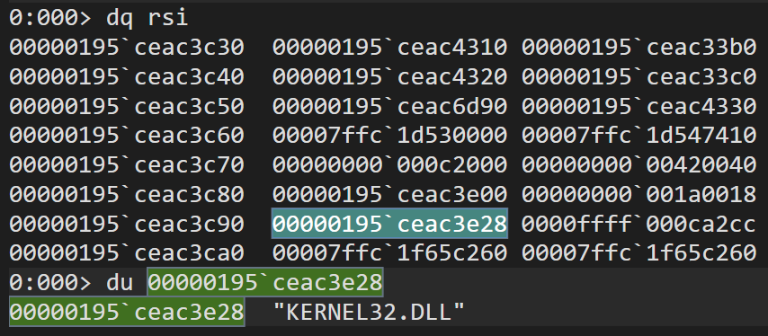
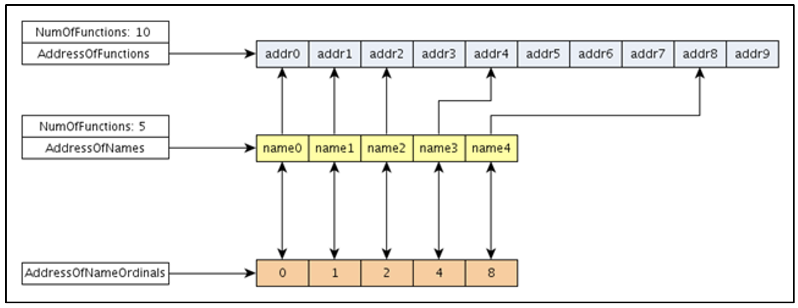

## シェルコード
このモジュールでは、Windows 環境におけるシェルコードの実装について解説する。

今までのモジュールで見てきたように、PE ファイルをメモリ上にロードする際には、リロケーション、DLL のインポート、API のアドレス解決といった処理が行われる。例えば、`MessageBoxA` という API を呼び出したいとき、まずはエクスポート元の User32.dll という DLL をロードして、次にこの API のアドレスを解決する必要がある。マルウェアの難読化、バイナリエクスプロイトの際には、こういったプロセスの文脈に依存しないコードが求められる場合があり、このようなコードはシェルコードと呼ばれる。

シェルコードはこういった API の使用を避けたり、自分で DLL をロードするような処理を実装している。初見殺しのコードになることが多く、このモジュールで紹介するような基本的なテクニックを知っておくと、解析がやりやすくなる。このモジュールでは、実際のシェルコード [shellcode_MessageBoxA.cpp](./shellcode_MessageBoxA.cpp) に基づいて解説する。

### kernel32
Kernel32.dll は最も基本的なライブラリで、ほとんどの実行ファイルにリンクされている。このライブラリは `LoadLibraryA` という API を提供しており、別のライブラリをロードして、任意の関数を呼び出す際に使用される。前述の理由で、このライブラリはほとんどのプロセスのメモリ空間で見つけることができるため、攻撃者のシェルコードでは、まずこのライブラリのベースアドレスを取得することが多い:

```asm
"find_kernel32:"
    " mov rsi, gs:[0x60];"               // RSI = &(PEB) ([GS:0x60])
    " mov rsi, [rsi+0x18];"              // RSI = PEB->Ldr
    " mov rsi, [rsi+0x10];"              // RSI = PEB->Ldr.InLoadOrderModuleList
"next_module:"
    " mov rbx, [rsi+0x30];"              // RBX = InLoadOrderModuleList[X].base_address
    " mov rdi, [rsi+0x60];"              // RDI = InLoadOrderModuleList[X].module_name
    " mov rsi, [rsi];"                   // RSI = InLoadOrderModuleList[X].flink (next)
    " xor cx, cx;"
    " cmp [rdi+12*2], cx;"               // (unicode) modulename[12] == 0x00?
    " jne next_module;"                  // No: try next module.
    " ret;"
```

上記のコードでは、`PEB->Ldr.InLoadOrderModuleList` でロードされているライブラリ情報の双方向リストを取得している。その後、モジュール名の12バイト目がヌルかどうかで Kernel32.dll を判別する。このライブラリではなかった場合は、`flink` (forward link) をたどって次のモジュール情報を見る。最終的に Kernel32.dll のベースアドレスが rbx に保存される。



### [Export Address Table (EAT)](https://ferreirasc.github.io/PE-Export-Address-Table/)
Export Address Table (EAT) とは IAT と対になるテーブルで、ライブラリによって提供される関数の情報が保存されている:


(Source: resources.infosecinstitute.com)

`AddressOfNames`、`AddressOfNameOrdinals` について、先頭から同じインデックスに存在する情報は、同じ関数のものを示している。よって、ある関数のアドレスを解決したい場合は、まず `AddressOfNames` の配列をたどってマッチする関数名を見つけ、そのインデックス X の位置にある `AddressOfNameOrdinals[X]` を取得する。この値は `AddressOfFunctions` のインデックスを示しているから、`AddressOfFunctions[AddressOfNameOrdinals[X]]` が関数のアドレスとなる。

まずは `AddressOfNames` を取得するコード:

```asm
"find_function:"
    // Base address of kernel32 is in RBX
    // from Previous step (find_kernel32)
    " xor rax, rax;"
    " xor rcx, rcx;"
    " xor rdi, rdi;"
    " xor rsi, rsi;"
    " mov eax, [rbx+0x3c];"              // Offset to PE Signature
    " mov edi, [rbx+rax+0x88];"          // Export Table Directory RVA
    " add rdi, rbx;"                     // Export Table Directory VMA
    " mov ecx, [rdi+0x18];"              // NumberOfNames
    " mov eax, [rdi+0x20];"              // AddressOfNames RVA
    " add rax, rbx;"                     // AddressOfNames VMA
    " mov [rbp-8], rax;"                 // Save AddressOfNames VMA for later
```

> [!NOTE]
> ここで、rbx は Kernel32.dll のベースアドレスを示している

> [!TIP]
> x64 環境で 32ビットサブレジスタに mov 命令を使うと、64ビットレジスタの他のサブレジスタは勝手にゼロクリアされる。例えば、上記の `mov eax, [rbx+0x3c]` では、rax の eax 以外のサブレジスタはゼロクリアされている。

### API hashing
次に関数名を探す処理... といきたいところだが、`MessageBoxA`、`WriteFile`、`connect` などと直接関数名を埋め込むと、長さが異なるため比較がやり辛い。また、マルウェアの場合、文字列がそのまま埋め込まれていると解析されやすくなってしまう。そのため、しばしば関数名をハッシュ値に変換し、ハッシュ値同士で比較する API hashing というテクニックが用いられる。以下にその一例を示す:

```asm
"find_function_loop:"
    " jecxz find_function_finished;"     // Jump to the end if ECX is 0
    " dec ecx;"                          // Decrement our names counter
    " mov rax, [rbp-8];"                 // Restore AddressOfNames VMA
    " mov esi, [rax+rcx*4];"             // Get the RVA of the symbol name
    " add rsi, rbx;"                     // Set RSI to the VMA of the current symbol name
"compute_hash:"
    " xor rax, rax;"                     // NULL RAX
    " xor rdx, rdx;"                     // NULL RDX
    " cld;"                              // Clear direction
"compute_hash_again:"
    " lodsb;"                            // Load the next byte from RSI into AL
    " test al, al;"                      // Check for NULL terminator
    " jz compute_hash_finished;"         // If the ZF is set, we've hit the NULL term
    " rol edx, 0x0d;"                    // Rotate edx 13 bits to the left
    " add edx, eax;"                     // Add the new byte to the accumulator
    " jmp compute_hash_again;"           // Next iteration
```

rsi には現在の関数名が保存されている。これを先頭から見ていき、edx に各文字をバイトとして追加していく。edx は追加される直前に 13ビット左シフトされる。

以下はハッシュの比較処理:

```asm
"find_function_compare:"
    " cmp edx, r10d;"                    // Compare the computed hash with the requested hash
    " jnz find_function_loop;"           // If it doesn't match go back to find_function_loop
    " mov edx, [rdi+0x24];"              // AddressOfNameOrdinals RVA
    " add rdx, rbx;"                     // AddressOfNameOrdinals VMA
    " mov cx, [rdx+2*rcx];"              // Extrapolate the function's ordinal
    " mov edx, [rdi+0x1c];"              // AddressOfFunctions RVA
    " add rdx, rbx;"                     // AddressOfFunctions VMA
    " mov eax, [rdx+4*rcx];"             // Get the function RVA
    " add rax, rbx;"                     // Get the function VMA
```

r10d には、欲しい関数名のハッシュ値が事前に計算されて渡される。この値と edx を比較し、マッチすれば `AddressOfFunctions[AddressOfNameOrdinals[X]]` を返す。

> [!NOTE]
> `AddressOfNameOrdinals` は2バイトの配列で、`AddressOfFunctions` は4バイトの配列

### ヌルバイトの除去
このモジュールの例では考慮していないが、アプリケーションの入力などに対してバイナリエクスプロイトを行う場合は、命令を工夫してヌルバイトを含まないシェルコードを作成する必要がある。これは、ヌルバイトが入力の終端と解釈され、その後のコードが無視されるのを防ぐため。

### Exercise 4.1
[ExecShellcode.exe](./ExecShellcode.exe) 中のシェルコードは、`MessageBoxA` を実行する。このシェルコードの処理で `CreateProcessA` のアドレスを解決したい場合、関数名のハッシュ値はどうなるだろうか?
