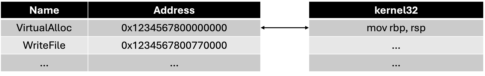
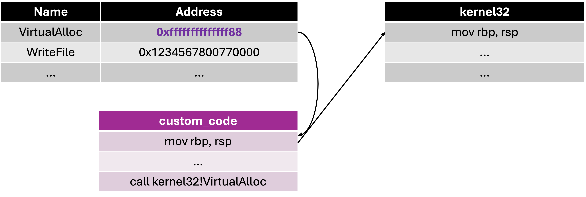
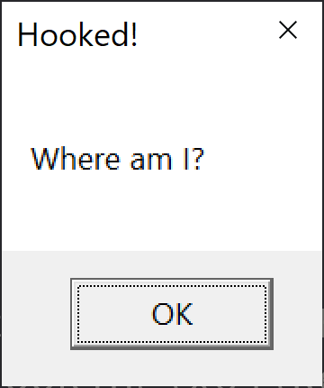
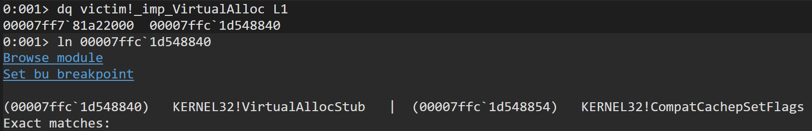
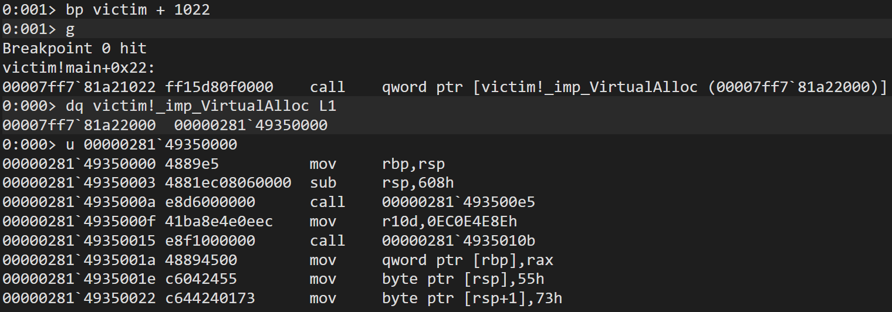

## Module 0x05: Hooking
このモジュールでは、hooking について解説する。Hooking とは自分以外のプロセスの挙動を監視するテクニックのことで、プロセスにコードを注入して、特定の処理が実行された際にそのコードが呼ばれるようにする。

### IAT Hooking
アンチウイルス製品や EDR は、特に IAT Hooking というテクニックを用いてマルウェアが使用する API を監視している。

通常、IAT には以下のように関数のアドレスが格納されている:



このアドレスを書き換えて自前のコード (トランポリン) を呼び出すことで、関数の呼び出し、渡される引数などを監視することができる:



IAT hooking は以下のように実装できる:

* プロセス内にトランポリンを確保
* トランポリンにシェルコードをコピー
* ILT からフックしたい API 名を探索
* 対応する IAT 内エントリのアドレスを書き換える

> [!NOTE]
> フックしたいプロセスは別プロセスである場合が多く、別プロセスのプロセス空間内の読み書きを行う場合は `ReadProcessMemory`、`WriteProcessMemory` といった API を用いる。

> [!NOTE]
> PE ファイルのロードが終わった後、IAT は READONLY になる。書き換える前に `VirtualProtectEx` などで READWRITE に変更する必要がある。

[HookIAT.exe](./HookIAT.exe) は IAT Hooking を実装したもので、渡された PE ファイルから子プロセスを生成し、IAT にシェルコードをフックする:

```
> HookIAT.exe <PE ファイルのフルパス> <API 名>
```

例えば、[victim.exe](./victim.exe) の `VirtualAlloc` にフックすると、トランポリンが `MessageBoxA` を実行する:

```
> HookIAT.exe "C:\Users\omega\Desktop\windows_binary_experiments\course\IATHooking\x64\Release\victim.exe" VirtualAlloc
PID: 4652
---------- PRESS ENTER ----------

PEB: 0x000000C0472F6000
Image Base: 0x00007FF781A20000
Victim size: 28672 bytes
VirtualAlloc found!
Now patching 0x00007FF781A22000
Original address: 0x7ffc1d548840

```



WinDbg を用いると、IAT が書き換えられる様子を詳細に確認できる。まずは上記の HookIAT.exe と同じコマンドを実行し、表示される PID を持つプロセスにアタッチする。フック前の段階では、IAT のエントリには `KERNEL32!VirtualAllocStub` が保存されていることが分かる:



次に `VirtualAlloc` が呼ばれる直前にブレークポイントを設定して再開、HookIAT.exe 側でエンターを押し、フックする。ブレークしたところで IAT を確認してみると、トランポリンの処理に書き換えられていることが分かる:



### IAT Hooking の検知
さて、攻撃者サイドからするとこのような監視を検知してバイパスしたい訳だが、防御サイドが上書きしたトランポリンのアドレスは、動的にヒープ領域に確保される。このアドレスはオリジナルの API が存在する DLL がロードされている範囲には含まれないはずだから、この事実を検知に使うことができる。[DetectIATHooks](./DetectIATHooks) はこの処理を実装したもので、kernel32.dll のベースアドレスと上限のアドレスを取得し、`VirtualAlloc` の IAT に保存されているアドレスがこの範囲に含まれるかチェックしている。

以下のようにフックを検知することができる:

```
> HookIAT.exe "C:\Users\omega\Desktop\windows_binary_experiments\course\IATHooking\x64\Release\DetectIATHooks.exe" VirtualAlloc
Debugging C:\Users\omega\Desktop\windows_binary_experiments\course\IATHooking\x64\Release\DetectIATHooks.exe
PID: 11332
---------- PRESS ENTER ----------

Kernel32 base address: 0x7FFC1D530000
Kernel32 size: 794624 bytes
kernel32: [0x00007FFC1D530000, 0x00007FFC1D5F2000)
Function: 0x7ffc1d548840
PEB: 0x0000002643FA9000
Image Base: 0x00007FF61D700000
Victim size: 36864 bytes
VirtualAlloc found!
Now patching 0x00007FF61D703008
Original address: 0x7ffc1d548840
Function: 0x1bc07b30000
The function 0x000001BC07B30000 is out of the kernel32 range!
```

> [!NOTE]
> DetectIATHooks は Release でビルドすること。Debug ビルドは異なるコードを吐く。

#### Exercise 5.1
[ForgeIAT.exe](./ForgeIAT.exe) は解析者への嫌がらせをするため、いずれかの関数の IAT のエントリを書き換えてある。
どの関数がいじられているのか、特定してほしい。関数名がフラグ。

### Windows API Hooking
API の命令そのものにパッチする方法は、API Hooking と呼ばれる。Microsoft Detours などのプロジェクトは、この手法で API の呼び出しを追跡している。
